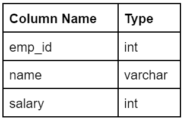

# SQL Queries Q&A

## Question 1: Find 2nd Highest Salary

**Problem:** Assume you are given the database of employees and their salaries. Write an SQL query to find the 2nd highest salary. Can you write the SQL query without using the window functions and LIMIT key?

### Solution 1: Without LIMIT and Window Functions

```sql
SELECT
    MAX(salary) AS second_highest_salary
FROM
    Employees
WHERE
    salary NOT IN (
        SELECT
            MAX(salary)
        FROM
            Employees
    );
```

### Solution 2: Using LIMIT with OFFSET

```sql
SELECT
    salary AS second_highest_salary
FROM
    Employees
ORDER BY
    salary DESC
LIMIT 1
OFFSET 1; -- (n-1)
```

---

## Question 2: Get All Active Users

**Problem:** Assume you have order data from a restaurant. Write an SQL query to get all active users.

**Definition of an Active User:**
- A returning active user is a user who has made a second purchase within 7 days of any of their previous purchases.
- The same user can place multiple purchases, but we only need to find those who meet the "second purchase within 7 days" rule.
- Return only distinct user_ids of active users.

### Solution

```sql
WITH UserPurchaseSequence AS (
    SELECT
        User_id,
        date AS current_purchase_date,
        LAG(date) OVER (PARTITION BY user_id ORDER BY date) AS previous_purchase_date
    FROM
        Orders
)
SELECT
    DISTINCT User_id
FROM
    UserPurchaseSequence
WHERE
    previous_purchase_date IS NOT NULL
    AND
    current_purchase_date <= previous_purchase_date + INTERVAL '7 DAY';
```

---

## Question 3: Interview Responses Analysis

**Problem Statement:** Given the Sample Table 'interview_responses'.

**Table Schema:**
- Respondent_id | name | age | gender | education | experience_years | salary_expectation

### Part 1: Average Salary Expectation

**Problem:** Write an SQL query to find the average salary expectation difference between male and female respondents with the same education level.

**Constraint:** You cannot use subqueries or CTEs.

```sql
SELECT
    Education,
    AVG(CASE WHEN gender = 'Male' THEN salary_expectation ELSE NULL END) - AVG(CASE WHEN gender = 'Female' THEN salary_expectation ELSE NULL END) AS avg_salary_expectation_difference
FROM
    Interview_responses
GROUP BY
    Education
HAVING
    COUNT(CASE WHEN gender = 'Male' THEN 1 ELSE NULL END) > 0
    AND
    COUNT(CASE WHEN gender = 'Female' THEN 1 ELSE NULL END) > 0
ORDER BY
    education; -- Added ORDER BY for consistent output
```

### Part 2: Highest Salary Expectation

**Problem:** Write an SQL query to find the respondent who has the highest salary expectation among those who have more experience years compared to the average experience years of all respondents.

```sql
SELECT
    Respondent_id,
    name,
    Salary_expectation,
    Experience_years
FROM
    Interview_responses
WHERE
    experience_years > (
        SELECT
            AVG(experience_years)
        FROM
            interview_responses
    )
ORDER BY
    salary_expectation DESC
LIMIT 1;
```

### Part 3: Most Experienced Respondent

**Problem:** Find the respondent with the most years of experience within each gender group, along with their salary and a prediction of their next year's salary expectation based on a 5% annual increase.

```sql
WITH RankedExperience AS (
    SELECT
        Respondent_id,
        name,
        Gender,
        Experience_years,
        Salary_expectation,
        RANK() OVER (PARTITION BY gender ORDER BY experience_years DESC, salary_expectation DESC) as rnk
    FROM
        Interview_responses
)
SELECT
    Respondent_id,
    Name,
    Gender,
    Experience_years,
    salary_expectation,
    (salary_expectation * 1.05) AS next_year_salary_prediction
FROM
    RankedExperience
WHERE
    rnk = 1
ORDER BY
    gender ASC,
    experience_years DESC;
```

---

## Question 4: Top 5 Cities with Most 5-Star Businesses

```sql
WITH city_5_stars_count AS (
    SELECT
        city,
        COUNT(*) AS num_5_star_businesses
    FROM
        business
    WHERE
        stars = 5.0
        AND
        is_open = 1
    GROUP BY
        city
)
SELECT
    city,
    num_5_star_businesses,
    RANK() OVER(ORDER BY num_5_star_businesses DESC) AS rank
FROM
    city_5_stars_count
WHERE
    rank <= 5;
```

---

## Question 5: Active Users

```sql
WITH curr_order_date_with_immediate_prev_order_date AS (
    SELECT
        user_id,
        date AS curr_date,
        LAG(date) OVER(PARTITION BY user_id ORDER BY date) AS prev_date
    FROM
        orders
)
SELECT
    DISTINCT user_id
FROM
    curr_order_date_with_immediate_prev_order_date
WHERE
    prev_date IS NOT NULL
    AND
    curr_date <= prev_date + INTERVAL '7 day';
```

---

## Question 6: Employee Salary Analysis by Region


**Part 1: Write an SQL query to find the minimum salary of an employee from each region.**

```sql
SELECT 
    r.region_name,
    MIN(e.salary) AS minimum_salary
FROM 
    employees e
    JOIN departments d ON e.department_id = d.department_id
    JOIN locations l ON d.location_id = l.location_id
    JOIN countries c ON l.country_id = c.country_id
    JOIN regions r ON c.region_id = r.region_id
GROUP BY 
    r.region_id, r.region_name
ORDER BY 
    r.region_name;
```

**Part 2: Write an SQL query to find the minimum salary of a manager from each region.**

```sql
SELECT 
    r.region_name,
    MIN(e.salary) AS minimum_manager_salary
FROM 
    employees e
    JOIN departments d ON e.department_id = d.department_id
    JOIN locations l ON d.location_id = l.location_id
    JOIN countries c ON l.country_id = c.country_id
    JOIN regions r ON c.region_id = r.region_id
WHERE 
    e.employee_id IN (SELECT DISTINCT manager_id FROM employees WHERE manager_id IS NOT NULL)
GROUP BY 
    r.region_id, r.region_name
ORDER BY 
    r.region_name;
```

**Part 3:  Write an SQL query to display the top 3 employees in each department who are getting more than the average salary of all the employees from each department.**

```sql
WITH DepartmentAverage AS (
    SELECT 
        department_id,
        AVG(salary) AS avg_salary
    FROM 
        employees
    GROUP BY 
        department_id
),
RankedEmployees AS (
    SELECT 
        e.employee_id,
        e.first_name,
        e.last_name,
        e.salary,
        e.department_id,
        da.avg_salary,
        RANK() OVER (PARTITION BY e.department_id ORDER BY e.salary DESC) AS salary_rank
    FROM 
        employees e
        JOIN DepartmentAverage da ON e.department_id = da.department_id
    WHERE 
        e.salary > da.avg_salary
)
SELECT 
    employee_id,
    first_name,
    last_name,
    salary,
    department_id,
    avg_salary AS department_avg_salary,
    salary_rank
FROM 
    RankedEmployees
WHERE 
    salary_rank <= 3
ORDER BY 
    department_id, salary_rank;
```

---

## Question 7: 

**Acme Studios Dataset description for movies table:**

| Column Name            | Description                                                     |
|------------------------|-----------------------------------------------------------------|
| id                     | IMDb movie id.                                                 |
| imdb_id                | IMDb movie id.                                                 |
| popularity             | A numeric quantity specifying the movie popularity.            |
| budget                 | The budget in which the movie was made.                        |
| revenue                | The worldwide revenue generated by the movie.                  |
| original_title         | The title of the movie.                                        |
| cast                   | The name of the lead and supporting actors.                    |
| homepage               | A link to the homepage of the movie.                           |
| director               | The name of the director of the movie.                         |
| tagline                | Movie's tagline.                                               |
| keywords               | The keywords or tags related to the movie.                     |
| overview               | A brief description of the movie.                              |
| runtime                | The running time of the movie in minutes.                      |
| genres                 | The genres of the movies.                                      |
| production_companies   | The production house of the movie.                             |
| release_date           | The date on which it was released.                             |
| vote_count             | The count of votes received.                                   |
| vote_average           | Average ratings the movie received.                            |
| release_year           | The year in which it was released.                             |

### Part 1:
Write an SQL query to create a new column named `"Weighted_avg_rating"` based on below formula. Then, we'll retrieve the `top 10` movies with the `highest weighted average ratings`, displaying the movie title (`"original_title"`) and the `weighted average rating`.

`Formula: (v/(v+m) * R) + (m/(m+v) * C )`

The formula provided takes into account the number of votes a movie has received `("v")` relative to a minimum threshold `("m")` set at `104` votes. It also factors in the movie's average rating `("R")` and the overall average vote rating across the entire dataset `("C")` set at `5.97`.

**Result:**

- Return the columns `original_title`, `Weighted_avg_rating`
- Return the output ordered by `Weighted_avg_rating` in `descending order` and `original_title` in `ascending order`.

```sql
select 
    original_title,
    ROUND((vote_count/(vote_count+104) * vote_average) + (104/(104+vote_count)*5.97), 2) as Weighted_avg_rating
FROM
    movies
order by
    Weighted_avg_rating desc,
    original_title asc
limit 10
```

### Part 2:
Write an SQL query that retrieves `all details` (not just revenue) for the movie with the `third-highest` revenue in the Acme Studios database. This will provide a comprehensive overview of a financially successful film, allowing executives to analyze factors that contributed to its performance and potentially replicate them in future projects.

**Result:**

- Return `all` the columns.
- No two movies have the same revenue. (i.e., all the values in the revenue column are unique).

```sql
SELECT
    *
FROM
    movies
order by
    revenue desc
limit 1
offset 2
```

### Part 3:
Write a query to display the titles of the movies that are released (i.e., release_year) after `2014` and have an average vote rating (i.e.,vote_average) `greater than 7`.

**Result:**

- Return the column `'original_title'`.
- Return the result ordered by `original_title` in ascending order.

```sql
SELECT
    original_title
FROM
    movies
where
    release_year > 2014
    and
    vote_average > 7
order by
    original_title asc
```

### Part 4:
Write a query to list down all the movies along with their details that have `keywords` like `'sport'` or `'sequel'` or `'suspense'`.

**Result:**

- Return the columns `'original_title'`, `'director'`, `'genres'`, `'cast'`, `'budget'`, `'revenue'`, `'runtime'`, and `'vote_average'`.
- Return the columns ordered by `original_title` in `ascending order`.

```sql
SELECT
    original_title,
    director,
    genres,
    cast,
    budget,
    revenue,
    runtime,
    vote_average
FROM
    movies
where
    keywords like '%sport%'
    or
    keywords like '%sequel%'
    or
    keywords like '%suspense%'
order by
    original_title asc
```

### Part 5:
Write a query to display the details of the movies which belong to the `'Horror'` genre.

**Result:**

- Return the columns `'original_title'`, and `'popularity'`.
- Return the result ordered by the `popularity` in `descending order`.

```sql
SELECT
    original_title,
    popularity
FROM
    movies
where
    genres like '%Horror%'
order by
    popularity desc
```

---

## Question 8: 

**Problem:** GlobalTech Solutions is a multinational company with thousands of employees spread across various departments.

The company's Human Resources (HR) department maintains a comprehensive database to manage employee information, including personal details, employment history, and departmental affiliations.

The HR department is interested in understanding the composition of some particular departments. By analyzing this data, they may be able to identify potential salary discrepancies across departments.

**Problem Description:**
Here's what we need to find:
- We are interested in employees working in the `'Administration'`, `'Marketing'`, and `'Human Resources'` departments.
- For each qualifying employee, we want to retrieve the employee_id, full_name (first and last name separated by space), and salary.
    - Use `CONCAT()` function to add 2 strings.
- We want the final results to be ordered by employee_id in ascending order for easier reference.


```sql
select
    e.employee_id,
    concat(e.first_name, ' ', e.last_name) as full_name,
    e.salary
FROM
    employees e join departments d on e.department_id = d.department_id
where
    d.department_name in ('Administration', 'Marketing', 'Human Resources')
order by
    e.employee_id asc
```

---

## Question 9: 

**Problem:** Write a query to find all the employees whose `first_name` ends with the letter `'n'`.

**Result:**
- Return the columns `'employee_id'`, `'full_name'` (first name and last name separated by space), and `'phone_number'`.
- Return the output ordered by `employee_id` in ascending order.


```sql
select
    employee_id,
    concat(first_name, ' ', last_name) as full_name,
    phone_number
from 
    employees
where
    first_name like '%n'
order by
    employee_id asc
```

---

## Question 10: 

**Problem:** Write a query to find the details of employees who are not working in any department.

**Result:**
- Return the columns `'employee_id'`, `'first_name'`, `'last_name'`, `'job_id'`, and `'manager_id'`.
- Return the result ordered by `employee_id` in ascending order.


```sql
SELECT
    employee_id,
    first_name,
    last_name,
    job_id,
    manager_id
FROM
    employees
where
    department_id is NULL
order by
    employee_id asc
```

---

## Question 11: 

**Problem:** write a SQL query to create a new column named Accountant.

If the employees are working in the `'FI_ACCOUNT'` or `'AC_ACCOUNT'` designation, label them as `1`; otherwise, label all other designations as `0`.
- The result should include the columns `employee_id`, `first_name`, `last_name`, `salary`, and `Accountant`.
- The result should be sorted `employee_id` in `ascending order` for easier reference.


```sql
select
    employee_id,
    first_name,
    last_name,
    salary,
    CASE
        WHEN job_id in ('FI_ACCOUNT', 'AC_ACCOUNT') THEN 1
        ELSE 0
    END as Accountant
from
    employees
order by
    employee_id asc
```

---

## Question 12: 

**Problem:** Write an SQL query to divide employees into three salary classes based on specified salary ranges and create a new column Salary_bin that indicates the class.

- Salary `greater than` 20,000 (i.e, excluding 20,000) as `'Class A'`
- Salary `between` 10,000 to 20,000 (i.e, including both 10,000 and 20,000) as `'Class B'`
- Salary `less than` 10,000 (i.e, excluding 10,000) as `'Class C'`.

The results should include the columns `employee_id`, `salary`, and `Salary_bin`, ordered by `employee_id` in `ascending order` for easier reference.


```sql
select
    employee_id,
    salary,
    case
        when salary < 10000 then 'Class C'
        when salary > 20000 then 'Class A'
        else 'Class B'
    end as Salary_bin
from
    employees
order by
    employee_id asc
```

---

## Question 13: 

**Problem:** Write an SQL query to retrieve details of all employees whose department is located in `Seattle`.

- The result should include the columns `employee_id`, `first_name`, `last_name`, and `job_id`.
- The result should be sorted by `employee_id` in `ascending order`.


```sql
SELECT
    employee_id,
    first_name,
    last_name,
    job_id
from
    employees e
    join departments d on e.department_id = d.department_id
    join locations l on d.location_id = l.location_id
        and
        l.city='Seattle'
order by
    employee_id asc
```

---

## Question 14: 

**Problem:** Write a SQL query to create a new column named `"New_salary"` within their "employees" table. This column will reflect the adjusted salary after applying a `20% raise` to the current salary ("salary").

**Steps to calculate the salary increment:**

- Multiply the current salary by the percentage of the increment.
- Divide the result by 100.
- Then add the result to the current salary.
- Name the column as 'New_Salary'
- Round off the 'New_salary'. Use Round() for this.

**Result:**

- Return the columns emp_id, name, salary, and 'New_salary'.
- Order the output by the emp_id in ascending order.



```sql
SELECT
    emp_id,
    name,
    salary,
    round(salary*1.2) as New_salary
from
    employees
order by
    emp_id asc
```

---

## Question 15: 

**Problem:** Write a query to report the movies with an `odd-numbered ID` and a description that is not `"boring"`.

- Return the result table ordered by `rating` in `descending order`.


```sql
SELECT
    *
FROM
    cinema
where
    id%2 = 1
    and
    description != 'boring'
order by
    rating desc
```

---

## Question 16: 

**Context:** GlobalTech Solutions is a multinational company with thousands of employees spread across various departments.

The company's Human Resources (HR) department maintains a comprehensive database to manage employee information, including personal details, employment history, and departmental affiliations.

The HR department is interested in understanding the composition of some particular departments. By analyzing this data, they may be able to identify potential salary discrepancies across departments.

**Problem Description:** Here's what we need to find:

- We are interested in employees working in the `'Administration'`, `'Marketing'`, and `'Human Resources'` departments.
- For each qualifying employee, we want to retrieve the `employee_id`, `full_name` (first and last name separated by space), and `salary`.
    - Use `CONCAT()` function to add 2 strings.
- We want the final results to be ordered by `employee_id` in `ascending order` for easier reference.


```sql
SELECT
    employee_id,
    concat(first_name, ' ', last_name) as full_name,
    salary
FROM
    employees join departments using (department_id)
where
    department_name in ('Administration', 'Marketing', 'Human Resources')
order by
    employee_id asc
```

---

## Question 17: 

**Problem:** Write a query to find all employees who share the `same job` as the employee with employee_id 107. Additionally, you need to create a new column `"full_name"` by concatenating `first_name` and `last_name`, separated by `space`.

- The result should include the columns `full_name`, `salary`, `department_id`, and `job_id`.
- The result should be sorted by `full_name` in `ascending order` for easier reference.


```sql
-- Query using subquery - optimized as we have index on employee_id as it's a PK - subquery gets executed in O(logN)
SELECT
    concat(first_name, ' ', last_name) as full_name,
    salary,
    department_id,
    job_id
from
    employees
where
    job_id = (SELECT job_id from employees where employee_id=107)
order by
    full_name asc
```

```sql
-- Query using join but it's unoptimized version until we don't have index on job_id
SELECT
    CONCAT(e.first_name, ' ', e.last_name) AS full_name,
    e.salary,
    e.department_id,
    e.job_id
FROM
    employees e
JOIN
    employees tgt
        ON e.job_id = tgt.job_id
WHERE
    tgt.employee_id = 107
ORDER BY
    full_name ASC;
```

---

## Question 18: 

**Problem:** Write a query to find all employees who are `not` present in the job_history table. This indicates they haven't held any jobs previously within the company.

- The result should `include all columns` from the employees table.
- The result should to be sorted by `employee_id` in `ascending order` for easier reference.

**Note:**

- To get the details of the employee's previous jobs refer to the job_history table.
- An employee is present in the job_history table if he/she has worked before.


```sql
SELECT
    e.*
FROM
    employees e 
    left join job_history jh on e.employee_id = jh.employee_id
where jh.employee_id is NULL
```

---

## Question 19: 

**Problem:** Write a query to display the details of those employees who have a manager working in the department that is US (i.e., country_id) based.

**Note:**

- Return the columns employee_id, first_name, and last_name.
- Return the result ordered by employee_id in ascending order.


```sql
SELECT
    e.employee_id,
    e.first_name,
    e.last_name
FROM
    employees e
    join employees m on e.manager_id = m.employee_id
    join departments d on m.department_id = d.department_id
    join locations l on l.location_id = d.location_id and l.country_id='US'
order by
    employee_id asc
```

---

## Question 20: 

**Problem:** Write a query to display the details of the employees who joined the company before their managers joined the company.

**Result:**

- Return the columns `'employee_id'`, `'first_name'`, and `'last_name'`.
- Return the result ordered by `employee_id` in `ascending order`.


```sql
SELECT
    e.employee_id,
    e.first_name,
    e.last_name
FROM
    employees e
    join employees m on e.manager_id = m.employee_id and e.hire_date < m.hire_date
order by
    employee_id asc
```

---

## Question 21: 

**Problem:** Write a query to display the details of all those departments that `don't` have any working employees.

**Result:**

- Return the columns `'department_id'`, and `'department_name'`.
- Return the results ordered by `'department_id'` in `ascending order`.


```sql
SELECT
    d.department_id,
    d.department_name
FROM
    departments d
    left join employees e on e.department_id = d.department_id
where
    e.employee_id is NULL
order by
    department_id asc
```

---

## Question 22: 

**Problem:** Write a SQL query to find all the details of employees who earn the `third-highest salary`.

- Return `all columns` from the employees table.
- Avoid using the `LIMIT` keyword in the query.


```sql
select
    employee_id,
    first_name,
    last_name,
    email,
    phone_number,
    hire_date,
    job_id,
    salary,
    commission_pct,
    manager_id,
    department_id
from (
        select
            *,
            dense_rank() over (order by salary desc) as salary_rank
        from
            employees
    ) as ranked_employees
where
    salary_rank = 3
```

---

## Question 23: 

**Problem:** Write a SQL query to find the details of the employees who earn less than the average salary in their respective departments.

- Return the columns `'employee_id'`, `'first_name'`, `'last_name'`, `'department_id'`, and `'salary'`.
- Return the output ordered by `employee_id` in `ascending order`.


```sql
-- Using CTE + WINDOW FUNCTION (Most Efficient & Cleanest)
WITH employees_dept_avg_salary AS (
    SELECT 
        employee_id,
        first_name,
        last_name,
        department_id,
        salary,
        AVG(salary) OVER (PARTITION BY department_id) AS dept_avg_salary
    FROM
        employees
)
SELECT 
    employee_id,
    first_name,
    last_name,
    department_id,
    salary
FROM
    employees_dept_avg_salary
WHERE
    salary < dept_avg_salary
ORDER BY
    employee_id ASC;
```

```sql
-- Using CTE + JOIN
WITH dept_avg AS (
    SELECT 
        department_id,
        AVG(salary) AS dept_avg_salary
    FROM employees
    GROUP BY department_id
)
SELECT 
    e.employee_id,
    e.first_name,
    e.last_name,
    e.department_id,
    e.salary
FROM
    employees e
    JOIN dept_avg d
    ON e.department_id = d.department_id
WHERE
    e.salary < d.dept_avg_salary
ORDER BY
    e.employee_id ASC;
```

```sql
-- Using subquery (Least Performance)
SELECT 
    e.employee_id,
    e.first_name,
    e.last_name,
    e.department_id,
    e.salary
FROM
    employees e
WHERE
    e.salary < (
        SELECT
            AVG(salary)
        FROM
            employees
        WHERE
            department_id = e.department_id
    )
ORDER BY
    e.employee_id ASC;
```

---

## Question 24: 

**Problem:** Write a SQL query to find the `"full_name"` (first_name and last_name, separated by `space`) of managers who oversee `four or more employees`.

The result should be ordered by `full_name`, lexicographically.
The column `manager_id` in the employees table represents the `employee_id` of the manager.


```sql
-- Using CTE(GroupBy + Having) + JOIN
with managers as (
    SELECT
        manager_id
    FROM
        employees
    group by
        manager_id
    having
        count(employee_id) > 3
)
SELECT
    concat(e.first_name, ' ', e.last_name) as full_name
FROM
    employees e
    join managers m
    on e.employee_id = m.manager_id
order by
    full_name asc
```

```sql
-- Using JOIN + GroupBy + Having
SELECT 
    CONCAT(m.first_name, ' ', m.last_name) AS full_name
FROM
    employees m
    JOIN employees e 
    ON m.employee_id = e.manager_id
GROUP BY
    m.employee_id, m.first_name, m.last_name
HAVING
    COUNT(e.employee_id) >= 4
ORDER BY
    full_name ASC;
```

```sql
-- Using SubQuery
SELECT 
    CONCAT(first_name, ' ', last_name) AS full_name
FROM
    employees m
WHERE
    m.employee_id IN (
        SELECT
            manager_id
        FROM
            employees
        GROUP BY
            manager_id
        HAVING
            COUNT(*) >= 4
    )
ORDER BY
    full_name ASC;
```

```sql
-- Using CTE + WINDOW FUNCTION
with managers as (
    SELECT
        distinct manager_id,
        count(*) over (partition by manager_id) as emp_count
    FROM
        employees
)
SELECT
    concat(e.first_name, ' ', e.last_name) as full_name
FROM
    employees e
    join managers m
    on e.employee_id = m.manager_id and m.emp_count > 3
order by
    full_name asc
```

---

## Question 24: 

**Problem:** Write a SQl query to display the details of those departments where the salary of each employee in that department is `at least 9000`.

- Return `all columns` from the departments table.
- Return the result ordered by `department_id` in `ascending order`.


```sql
-- Using JOIN + GroupBy + Having
SELECT
    d.*
FROM
    employees e
    join departments d
    on e.department_id = d.department_id
group by
    d.department_id, d.department_name, d.manager_id, d.location_id
having
    min(e.salary) >= 9000
order by
    department_id asc
```

```sql
-- Using a Correlated Subquery
SELECT
    *
FROM
    departments d
WHERE
    9000 <= (
        SELECT
            MIN(salary)
        FROM
            employees e
        WHERE
            e.department_id = d.department_id
    )
ORDER BY
    d.department_id ASC;
```

```sql
-- Using CTE + WINDOW FUNCTION (MIN)
WITH emp_mins AS (
    SELECT 
        department_id,
        MIN(salary) OVER (PARTITION BY department_id) AS dept_min_salary
    FROM
        employees
)
SELECT
    DISTINCT d.*
FROM
    departments d
    JOIN emp_mins e
    ON d.department_id = e.department_id
WHERE
    e.dept_min_salary >= 9000
ORDER BY
    d.department_id ASC;
```

---

## Question 25:
**Problem:** Write a query to find the `average salary` of the employees for each department.

- Save the new average salary as `'Average_salary'`.
- Return the columns `'department_id'`, `'department_name'`, and `'Average_salary'`.
- Return the result ordered by `department_id` in `ascending order`.


```sql
-- Using JOIN + GroupBy (AVG)
SELECT
    d.department_id,
    d.department_name,
    avg(e.salary) as Average_salary
FROM
    employees e
    join departments d
    on e.department_id = d.department_id
group by
    d.department_id,
    d.department_name
order by
    d.department_id asc;
```

```sql
-- Using CTE (GroupBy (AVG)) + JOIN
WITH dept_avg AS (
    SELECT 
        department_id,
        AVG(salary) AS Average_salary
    FROM employees
    GROUP BY department_id
)
SELECT 
    d.department_id,
    d.department_name,
    a.Average_salary
FROM departments d
JOIN dept_avg a
    ON d.department_id = a.department_id
ORDER BY d.department_id;
```

```sql
-- Using WINDOW FUNCTION (AVG)
SELECT DISTINCT
    d.department_id,
    d.department_name,
    AVG(e.salary) OVER (PARTITION BY d.department_id) AS Average_salary
FROM
    employees e
    JOIN departments d
    ON e.department_id = d.department_id
ORDER BY
    d.department_id ASC;
```

---

## Question 26:
**Problem:** Given a list of candidates and their skills, write a SQL query to find the candidates who possess all three required skills for the Data Science position.

- Note that there are no duplicates in the candidates table.
- Return the result ordered by candidate_id in ascending order.

    

```sql
select
    candidate_id
FROM
    candidates
where
    skill in ('Python', 'Tableau', 'MySQL')
group by
    candidate_id
having
    count(distinct skill) = 3
order by
    candidate_id asc
```

---

## Question 27:
**Problem:** Write a query to display the employee's full name (first name and last name separated by space) as 'full_name' of all those employees whose salary is `greater than 40%` of their department’s total salary `or` employees who don't belong to any department.

- Return the column `'full_name'`.
- Return the output ordered by `full_name` in `ascending order`.


```sql
-- Using WINDOW FUNCTION (SUM)
SELECT 
    CONCAT(first_name, ' ', last_name) AS full_name
FROM (
    SELECT 
        e.*,
        SUM(salary) OVER (PARTITION BY department_id) AS dept_total_salary
    FROM employees e
) d
WHERE d.department_id IS NULL
   OR d.salary > 0.4 * d.dept_total_salary
ORDER BY full_name;
```

```sql
-- Using CTE + LEFT JOIN + GroupBy(SUM)
WITH dept_sums AS (
    SELECT 
        department_id,
        SUM(salary) AS total_salary
    FROM employees
    GROUP BY department_id
)
SELECT 
    CONCAT(e.first_name, ' ', e.last_name) AS full_name
FROM employees e
LEFT JOIN dept_sums d
    ON e.department_id = d.department_id
WHERE e.department_id IS NULL
   OR e.salary > 0.4 * d.total_salary
ORDER BY full_name;
```

```sql
-- Using Correlated Subquery
SELECT 
    CONCAT(e.first_name, ' ', e.last_name) AS full_name
FROM employees e
WHERE e.department_id IS NULL
   OR e.salary > 0.4 * (
        SELECT SUM(salary)
        FROM employees
        WHERE department_id = e.department_id
     )
ORDER BY full_name;
```

---

## Question 28:
**Problem:** Write a query to calculate

- the `row number` and save it as 'emp_row_no',
- `rank` and save as 'emp_rank', and
- the `dense rank` of employees as 'emp_dense_rank'

based on the `salary` column in `descending order within each department` using the employees table.

**Result:**

- Return the columns `'full_name'` (first_name and last_name separated by space), `'department_id'`, `'salary'`, `'emp_row_no'`, `'emp_rank'`, and `'emp_dense_rank'`.
- Return the result ordered by `department_id` in `ascending order` and `salary` in `descending order`.


```sql
SELECT
    concat(first_name, ' ', last_name) as full_name,
    department_id,
    salary,
    ROW_NUMBER() over (partition by department_id order by salary desc) as emp_row_no,
    RANK() over (partition by department_id order by salary desc) as emp_rank,
    DENSE_RANK() over (partition by department_id order by salary desc) as emp_dense_rank
FROM
    employees
order by
    department_id asc,
    salary desc
```

---

## Question 29:
**Problem:** Write a query to display the details of the employees who have the `5th highest` salary in each job category.

- Return the columns `'employee_id'`, `'first_name'`, and `'job_id'`.
- Return the result ordered by `employee_id` in `ascending order`.


```sql
with salary_rank as (
    SELECT
        employee_id,
        first_name,
        job_id,
        DENSE_RANK() over (partition by job_id order by salary desc) as pos
    FROM
        employees
)
SELECT
    employee_id,
    first_name,
    job_id
FROM
    salary_rank
where
    pos = 5
order by
    employee_id asc;
```

---

## Question 30:
**Problem:** Write a query to find the `customer_id` and `customer_name` of customers who bought products `"Bread"` and `"Milk"` but did not buy the product `"Eggs"`.

- Return the columns `customer_id` and `customer_name`
- Return the output ordered by `customer_name` in `ascending order`

**Table: customers**


---
**Table: orders**


```sql
SELECT
    c.customer_id,
    c.customer_name
FROM
    customers c
    join orders o on c.customer_id = o.customer_id
group by
    c.customer_id, c.customer_name
having
    sum(o.product_name='Bread')>0
    and
    sum(o.product_name='Milk')>0
    and
    sum(o.product_name='Eggs')=0
order by
    c.customer_name asc;
```   

```sql
SELECT
    c.customer_id,
    c.customer_name
FROM
    customers c
    join orders o on c.customer_id = o.customer_id
group by
    c.customer_id, c.customer_name
having
    count(distinct case when o.product_name in ('Bread', 'Milk') then product end) = 2
    and
    count(case when o.product_name='Eggs' then 1 end) = 0
order by
    c.customer_name asc;
```    

---

## Question 31:
**Problem:** A company wants to divide the employees into teams such that all the members of each team have the same salary. The teams should follow these criteria:

- Each team should consist of `at least two` employees.
- All the employees on a team should have the `same` salary.
- All the employees with the `same salary` should be assigned to the `same team`.
- If an employee's salary is `unique`, we `do not assign` this employee to any team.
- A team's ID is assigned based on the rank of the team's salary relative to the other teams' salaries, where the team with the `lowest salary` has `team_id = 1`.
- Note that the salaries for employees not on a team are not included in this ranking.

**Write a query to get the `team_id` of each employee that is in a team.**

- Return the result table ordered by `team_id` in `ascending order`. In case of a tie, order it by `employee_id` in `ascending order`.


```sql
with salaries as (
    SELECT
        salary
    FROM
        employees
    group by
        salary
    having
        count(*) >= 2
),
ranked_salaries as (
    SELECT
        salary,
        dense_rank() over (order by salary asc) as team_id
    FROM
        salaries
)
SELECT
    e.employee_id,
    e.name,
    e.salary,
    rs.team_id
FROM
    employees e 
    join ranked_salaries rs on e.salary = rs.salary
order by
    team_id asc,
    employee_id asc
```

---

## Question 32:
**Problem:** Write a query to find the `first day of the first job` of employees with job history and return it as 'first_day_job'.

- Return the columns `'first_name'` and `'first_day_job'`.
- Return the result ordered by first_name in ascending order.

```sql
-- Using JOIN + GroupBy(MIN)
SELECT
    e.first_name,
    min(jh.start_date) as first_day_job
FROM
    employees e 
    join job_history jh on e.employee_id = jh.employee_id
group by
    e.employee_id,
    e.first_name
order by
    e.first_name asc;
```

```sql
-- Using WINDOW FUNCTION (MIN/FIRST_VALUE)
SELECT DISTINCT
    e.first_name,
    MIN(jh.start_date) OVER (PARTITION BY e.employee_id) AS first_day_job
    --first_value(jh.start_date) OVER (PARTITION BY e.employee_id order by jh.start_date asc) AS first_day_job
FROM
    employees e
    JOIN job_history jh
    ON e.employee_id = jh.employee_id
ORDER BY
    e.first_name ASC;
```

```sql
-- Using Correlated Subquery
SELECT
    e.first_name,
    jh.first_day_job
FROM
    employees e
    JOIN (
        SELECT
            employee_id,
            MIN(start_date) AS first_day_job
        FROM
            job_history
        GROUP BY
            employee_id
    ) jh
    ON e.employee_id = jh.employee_id
ORDER BY e.first_name;
```

---

## Question 33:
**Problem:** Write a query to find the starting `maximum salary of the first job` that every employee held and return it as 'first_job_sal'.

**Result:**

- Return the columns `'first_name'`, `'last_name'`, `'first_job_sal'`.
- Return the result sorted by `first_name` in `ascending order`.

**Note:**

- Refer to the job_history table to get the job details of the employees.
- Refer to the employees table for first_name and last_name.
- Refer to the jobs table for the maximum salary.


```sql
-- Using JOIN + GroupBy(MIN)
with first_jobs as (
    SELECT distinct
        employee_id,
        MIN(start_date) as first_job_date
    FROM
        job_history
    group by
        employee_id
)
SELECT
    e.first_name,
    e.last_name,
    j.max_salary as first_job_sal
FROM
    job_history jh
    join first_jobs fj on fj.employee_id=jh.employee_id and jh.start_date=fj.first_job_date
    join employees e on e.employee_id = jh.employee_id
    join jobs j on j.job_id = jh.job_id
order by
    e.first_name asc
```

```sql
-- Using WINDOW FUNCTION (ROW_NUMBER)
WITH ranked_history AS (
    SELECT 
        jh.employee_id,
        jh.job_id,
        jh.start_date,
        ROW_NUMBER() OVER (PARTITION BY jh.employee_id ORDER BY jh.start_date) AS rn
        --MIN(start_date) OVER (PARTITION BY employee_id) AS min_start
    FROM
        job_history jh
)
SELECT
    e.first_name,
    e.last_name,
    j.max_salary AS first_job_sal
FROM
    ranked_history rh
    JOIN employees e ON e.employee_id = rh.employee_id
    JOIN jobs j ON j.job_id = rh.job_id
WHERE
    rh.rn = 1
    --rh.start_date = rh.min_start
ORDER BY
    e.first_name ASC;
```

```sql
-- Using Correlated Subquery
SELECT
    e.first_name,
    e.last_name,
    (
        SELECT
            j.max_salary
        FROM
            job_history jh
            JOIN jobs j ON j.job_id = jh.job_id
        WHERE
            jh.employee_id = e.employee_id
        ORDER BY
            jh.start_date
        limit 1
    ) AS first_job_sal
FROM employees e
WHERE EXISTS (
    SELECT 1 FROM job_history jh WHERE jh.employee_id = e.employee_id
)
ORDER BY e.first_name;
```

---

## Question 34:
**Problem:** Write a query to display the details of employees who have been working in the company for `at least 28 years as of June 8, 2022`.

This involves calculating the total number of years (Total_years) each employee has been with the company and identifying those who meet or exceed the 28-year threshold.

- The result should include the columns `employee_id`, `first_name`, `last_name`, and the `Total_years` they've worked with us.
- The result should be ordered by `employee_id` in `ascending order` for clarity and ease of reference.

**Note:**

- To get the `Total_years`, calculate the difference in days between the hire date and June 8, 2022.
- Then, convert this difference into years by dividing by `365`.
- Don't forget to round the total years up to `two decimal points`.


```sql
SELECT
    employee_id,
    first_name,
    last_name,
    ROUND(DATEDIFF('2022-06-08', hire_date) / 365, 2) AS Total_years
FROM employees
WHERE (DATEDIFF('2022-06-08', hire_date) / 365) >= 28
ORDER BY employee_id ASC;
```

---

## Question 35:
**Problem:** Write a query  to display the details of managers who have been working in the company for `more than 25 years as of June 8, 2022`.

This involves calculating the total number of years each manager has been with the company and saving it as Experience.

**Result:**

The result should include the columns `employee_id`, `first_name`, `last_name`, `salary`, `department_name`, and `Experience`.
The result should be ordered by `employee_id` in `ascending order` for clarity and ease of reference.

**Note:**

To get the `Experience` of the managers, calculate the difference in days between the hire date and June 8, 2022.
Then, convert this difference into years by dividing by `365`.
Don't forget to round the total years up to `four decimal points`.


```sql
SELECT 
    m.employee_id,
    m.first_name,
    m.last_name,
    m.salary,
    d.department_name,
    ROUND(DATEDIFF('2022-06-08', m.hire_date) / 365, 4) AS Experience
FROM employees e
JOIN employees m ON e.manager_id = m.employee_id
JOIN departments d ON d.department_id = m.department_id
WHERE (DATEDIFF('2022-06-08', m.hire_date) / 365) > 25
GROUP BY 
    m.employee_id,
    m.first_name,
    m.last_name,
    m.salary,
    d.department_name,
    m.hire_date
ORDER BY m.employee_id ASC;
```

```sql
WITH managers AS (
    SELECT DISTINCT manager_id
    FROM employees
    WHERE manager_id IS NOT NULL
)
SELECT
    m.employee_id,
    m.first_name,
    m.last_name,
    m.salary,
    d.department_name,
    ROUND(DATEDIFF('2022-06-08', m.hire_date) / 365, 4) AS Experience
FROM managers mg
JOIN employees m ON m.employee_id = mg.manager_id
JOIN departments d ON m.department_id = d.department_id
WHERE (DATEDIFF('2022-06-08', m.hire_date) / 365) > 25
ORDER BY m.employee_id ASC;
```

```sql
SELECT 
    m.employee_id,
    m.first_name,
    m.last_name,
    m.salary,
    d.department_name,
    ROUND(DATEDIFF('2022-06-08', m.hire_date) / 365, 4) AS Experience
FROM employees m
JOIN departments d ON m.department_id = d.department_id
WHERE EXISTS (
    SELECT 1
    FROM employees e
    WHERE e.manager_id = m.employee_id
)
AND (DATEDIFF('2022-06-08', m.hire_date) / 365) > 25
ORDER BY m.employee_id ASC;
```

---

## Question 36:
**Context:**

UrbanMall is dedicated to understanding customer traffic patterns to enhance mall operations and optimize resource allocation. Identifying peak traffic periods where multiple consecutive visits had high attendance is crucial for making strategic decisions on staffing and promotions.

As a data analyst at UrbanMall, your task is to identify and report instances where there were three or more consecutive visits with a significant number of people, specifically 100 or more, during each visit. This analysis will help in recognizing patterns of high traffic and planning accordingly.

**Problem:**

- Each row in the table contains the visit_date and visit_id to the mall with the number of people during the visit. No two rows will have the same visit_date
- Write a query to find and display records where there are `three or more` consecutive visits with each having at least 100 people.

**Result:**

- Return the columns `visit_id`, `visit_date`, and `people`.
- Return the result ordered by `visit_date` in `ascending order`.

```sql
with mall_ppl as (
    select 
        id,
        visit_date,
        people, 
        lead(people) over (order by id asc) as next1,
        lead(people,2) over (order by id asc) as next2,
        lag(people)over (order by id asc) as prev1,
        lag(people,2)over (order by id asc) as prev2
    from
        mall
)
select 
    id,
    visit_date,
    people
from
    mall_ppl
where 
    (people >= 100 and next1 >= 100 and next2 >= 100) or 
    (people >= 100 and prev1 >= 100 and prev2 >= 100) or
    (people >= 100 and prev1 >= 100 and next1 >= 100)
order by
    visit_date asc;
```

```sql
WITH flagged AS (
    SELECT
        id,
        visit_date,
        people,
        CASE 
            WHEN people >= 100 THEN 1 
            ELSE 0 
        END AS is_high
    FROM mall
),
grp AS (
    SELECT
        id,
        visit_date,
        people,
        is_high,
        -- Create an island group for consecutive high-traffic mall
        ROW_NUMBER() OVER (ORDER BY visit_date) -
        ROW_NUMBER() OVER (PARTITION BY is_high ORDER BY visit_date) AS grp_id
    FROM flagged
),
qualified AS (
    SELECT
        grp_id
    FROM grp
    WHERE is_high = 1
    GROUP BY grp_id
    HAVING COUNT(*) >= 3      -- keep only islands of length 3 or more
)
SELECT
    g.id,
    g.visit_date,
    g.people
FROM grp g
JOIN qualified q ON g.grp_id = q.grp_id
WHERE g.is_high = 1
ORDER BY g.visit_date;
```

---

## Question 37:
**Problem:** Write a query to calculate the net salary for the employees and save the column as 'Net_Salary' and display the details of those employees whose net salary is greater than 15000.

**Note:** To calculate the `'Net_Salary' = salary + salary *(commission_pct)`.

- If the column 'comission_pct' consists of null values replace them with zeros.

**Result:**

- Return the columns `'employee_id'`, `'first_name'`, `'last_name'`, `'salary'`, and `'Net_Salary'`.
- Return the result ordered by `employee_id` in `ascending order`.


```sql
with emps as (
    select
        employee_id,
        first_name,
        last_name,
        salary,
        (salary + salary * (case when commission_pct is NULL then 0 else commission_pct end)) as Net_Salary
    FROM
        employees
)
select
    employee_id,
    first_name,
    last_name,
    salary,
    Net_Salary
FROM
    emps
where
    Net_Salary > 15000
order by
    employee_id asc
```

---

## Question 38:
**Problem:** Create a view as `'emp_view'` that has the details i.e, `employee_id`, `first_name`, `last_name`, `salary`, `department_id`, `department_name`, `location_id`, `street_address`, and `city`.

Write a query to display the details from the view of those employees who work in `departments` that are located in `Seattle` or `Southlake`.

**Result:**

- Return the view with columns `'employee_id'`, `'first_name'`, `'last_name'`, `'salary'`, `'department_id'`, `'department_name'`, `'location_id'`, `'street_address'`, `'city'`.
- Return the result ordered by `employee_id` in `ascending order`.


```sql
create or replace view emp_view as
    select 
        employee_id,
        first_name,
        last_name,
        salary, 
        dep.department_id,
        department_name,
        loc.location_id,
        street_address,
        city 
    from
        employees emp 
        join departments dep on emp.department_id = dep.department_id
        join locations loc on dep.location_id = loc.location_id;

select
    *
from
    emp_view
where
    city in ('Seattle','Southlake')
order by
    employee_id asc;
```

---

## Question 39:
**Problem:** Write a query to create a view named `Manager_details` that identifies employees who are managers (i.e., employees who have at least one direct report) and includes their details along with a salary rank based on their salary.

Then, use the view to generate a report that returns the following for the `top 5 highest-paid managers`:

- `employee_id`: The unique identifier for the manager.
- `Manager`: The full name of the manager (concatenated first and last name).
- `salary`: The manager's salary.
- `department_name`: The name of the department the manager works in.
- `city`: The city where the manager's department is located.
- `country_name`: The country where the manager's department is located.
- The results should be ordered by the salary rank (highest salary first) and limited to the top 5 managers based on their salary rank.

**Result:**

- Return the columns as per the sample output from the view `Manager_details`.
- Return the result ordered by `salary` column in `descending order` and by `Manager` in `ascending order`.
- `No duplication` of manager details is expected in the output.


```sql
create or replace view Manager_details as
    SELECT DISTINCT
        m.employee_id,
        concat(m.first_name, ' ', m.last_name) as Manager,
        m.salary,
        d.department_name,
        l.city,
        c.country_name,
        dense_rank() over (order by m.salary desc) as sal_rank
    FROM
        employees e
        join employees m on e.manager_id=m.employee_id
        join departments d on m.department_id = d.department_id
        join locations l on d.location_id = l.location_id
        join countries c on l.country_id = c.country_id;

SELECT
    employee_id,
    Manager,
    salary,
    department_name,
    city,
    country_name
from
    Manager_details
where sal_rank <= 5;
```

---

## Question 40:
**Problem:** Write a query to calculate the total sales amount of each item for each year, with the corresponding product_id, product_name, and report_year.

Order the output by product_id and report_year in ascending order.
Use the CTE method.
The sales period for products in the test cases ranges from the years 2018 to 2022.


```sql
with cte as (
    select
        *
    from
        (
            select
                product_id,
                '2018' as report_year,
                average_daily_sales * (datediff(least('2018-12-31', period_end), greatest('2018-01-01', period_start))+1) as total_amount
            from
                sales
            union all
            select 
                product_id,
                '2019' as report_year, 
                average_daily_sales*(datediff(least('2019-12-31', period_end), greatest('2019-01-01', period_start))+1) as total_amount
            from
                sales
            union all
            select 
                product_id,
                '2020' as report_year, 
                average_daily_sales*(datediff(least('2020-12-31', period_end), greatest('2020-01-01', period_start))+1) as total_amount
            from
                sales
            union all
            select
                product_id,
                '2021' as report_year, 
                average_daily_sales*(datediff(least('2021-12-31', period_end), greatest('2021-01-01', period_start))+1) as total_amount
            from
                sales
            union all
            select
                product_id,
                '2022' as report_year, 
                average_daily_sales*(datediff(least('2022-12-31', period_end), greatest('2022-01-01', period_start))+1) as total_amount
            from
                sales
        ) p
    where
        total_amount > 0
)
select 
    a.product_id,
    b.product_name,
    a.report_year,
    a.total_amount
from
    cte a
    left join products b on a.product_id = b.product_id
order by
    a.product_id, a.report_year;
```

```sql
with years as (
    select distinct
        year(period_start) as report_year
    from
        sales
    union
    select distinct
        year(period_end) as report_year
    from
        sales
),
temp as (
    select
        product_id, 
        average_daily_sales * (datediff(least(concat(report_year,"-12-31"), period_end),
        greatest(concat(report_year,"-01-01"), period_start))+1) as total_amount, 
        report_year
    from
        sales
        cross join years
    where
        year(period_start)<= report_year 
        and year(period_end)>= report_year
)
select
    t.product_id,
    product_name,
    report_year,
    total_amount
from
    temp t 
    join products p on t.product_id = p.product_id
order by
    t.product_id, report_year;
```