# Elevator System - UML Class Diagram
https://www.mermaidchart.com/

```mermaid
classDiagram
    %% =============== ENUMERATIONS ===============
    class Direction {
        <<enumeration>>
        UP
        DOWN
        IDLE
    }
    
    class ElevatorState {
        <<enumeration>>
        IDLE
        MOVING_UP
        MOVING_DOWN
        MAINTENANCE
    }
    
    class DoorStatus {
        <<enumeration>>
        OPEN
        CLOSED
    }
    
    class ButtonType {
        <<enumeration>>
        UP
        DOWN
        FLOOR_SELECTION
        EMERGENCY
        DOOR_OPEN
        DOOR_CLOSE
    }
    
    class PanelType {
        <<enumeration>>
        FLOOR
        CABIN
    }
    
    class RequestType {
        <<enumeration>>
        EXTERNAL
        INTERNAL
    }
    
    class RequestStatus {
        <<enumeration>>
        PENDING
        ASSIGNED
        IN_PROGRESS
        COMPLETED
        CANCELLED
    }

    %% =============== CORE MODELS ===============
    class Building {
        -id: string
        -name: string
        -totalFloors: number
        -createdAt: Date
        -updatedAt: Date
        +constructor(name, totalFloors, id?)
        +update(): void
    }
    
    class Floor {
        -id: string
        -buildingId: string
        -floorNumber: number
        -createdAt: Date
        -updatedAt: Date
        +constructor(buildingId, floorNumber, id?)
        +update(): void
    }
    
    class Elevator {
        -id: string
        -buildingId: string
        -elevatorCode: string
        -capacity: number
        -currentFloor: number
        -direction: Direction
        -state: ElevatorState
        -doorStatus: DoorStatus
        -currentLoad: number
        -destinationQueue: number[]
        -currentStateObject: IElevatorState
        -createdAt: Date
        -updatedAt: Date
        +constructor(buildingId, elevatorCode, capacity, id?)
        +setStateObject(stateObj): void
        +moveUp(): void
        +moveDown(): void
        +stop(): void
        +openDoor(): void
        +closeDoor(): void
        +addDestination(floor): void
        +removeDestination(floor): void
        +getNextDestination(): number
        +hasDestinations(): boolean
        +update(): void
    }
    
    class Panel {
        -id: string
        -panelType: PanelType
        -floorId: string
        -elevatorId: string
        -createdAt: Date
        -updatedAt: Date
        +constructor(panelType, floorId?, elevatorId?, id?)
        +update(): void
    }
    
    class Button {
        -id: string
        -panelId: string
        -buttonType: ButtonType
        -targetFloor: number
        -label: string
        -isPressed: boolean
        -createdAt: Date
        -updatedAt: Date
        +constructor(panelId, buttonType, label, targetFloor?, id?)
        +press(): void
        +reset(): void
        +update(): void
    }
    
    class Request {
        <<abstract>>
        -id: string
        -requestType: RequestType
        -buildingId: string
        -status: RequestStatus
        -createdAt: Date
        -updatedAt: Date
        -completedAt: Date
        +constructor(requestType, buildingId, id?)
        +updateStatus(status): void
        +complete(): void
        +update(): void
    }
    
    class ExternalRequest {
        -sourceFloor: number
        -direction: Direction
        -elevatorId: string
        +constructor(buildingId, sourceFloor, direction, id?)
        +assignElevator(elevatorId): void
    }
    
    class InternalRequest {
        -elevatorId: string
        -destinationFloor: number
        +constructor(buildingId, elevatorId, destinationFloor, id?)
    }

    %% =============== STATE PATTERN ===============
    class IElevatorState {
        <<interface>>
        +handleRequest(elevator, floor): void
        +move(elevator): void
        +getDirection(): Direction
        +getStateName(): string
    }
    
    class IdleState {
        +handleRequest(elevator, floor): void
        +move(elevator): void
        +getDirection(): Direction
        +getStateName(): string
    }
    
    class MovingUpState {
        +handleRequest(elevator, floor): void
        +move(elevator): void
        +getDirection(): Direction
        +getStateName(): string
    }
    
    class MovingDownState {
        +handleRequest(elevator, floor): void
        +move(elevator): void
        +getDirection(): Direction
        +getStateName(): string
    }

    %% =============== STRATEGY PATTERN ===============
    class ISchedulingStrategy {
        <<interface>>
        +selectElevator(elevators, request): Elevator
        +getStrategyName(): string
        +getDescription(): string
    }
    
    class NearestElevatorStrategy {
        +selectElevator(elevators, request): Elevator
        +getStrategyName(): string
        +getDescription(): string
        -findNearestElevator(elevators, floor): Elevator
        -isElevatorSuitable(elevator, request): boolean
        -calculateDistance(elevator, floor): number
    }

    %% =============== REPOSITORY PATTERN ===============
    class IRepository~T~ {
        <<interface>>
        +findById(id): T
        +findAll(): T[]
        +save(entity): T
        +delete(id): boolean
        +exists(id): boolean
        +count(): number
        +clear(): void
    }
    
    class BuildingRepository {
        -buildings: Map
        +findById(id): Building
        +findAll(): Building[]
        +save(building): Building
        +delete(id): boolean
    }
    
    class FloorRepository {
        -floors: Map
        +findById(id): Floor
        +findByBuildingId(buildingId): Floor[]
        +findByFloorNumber(buildingId, floorNumber): Floor
        +save(floor): Floor
    }
    
    class ElevatorRepository {
        -elevators: Map
        +findById(id): Elevator
        +findByBuildingId(buildingId): Elevator[]
        +findAvailableByBuildingId(buildingId): Elevator[]
        +save(elevator): Elevator
    }
    
    class PanelRepository {
        -panels: Map
        +findById(id): Panel
        +findByFloorId(floorId): Panel
        +findByElevatorId(elevatorId): Panel
        +save(panel): Panel
    }
    
    class ButtonRepository {
        -buttons: Map
        +findById(id): Button
        +findByPanelId(panelId): Button[]
        +save(button): Button
    }
    
    class RequestRepository {
        -requests: Map
        +findById(id): Request
        +findByBuildingId(buildingId): Request[]
        +findPendingExternalRequests(buildingId): ExternalRequest[]
        +save(request): Request
    }

    %% =============== SERVICES ===============
    class BuildingService {
        -buildingRepo: BuildingRepository
        -floorRepo: FloorRepository
        -elevatorRepo: ElevatorRepository
        -panelRepo: PanelRepository
        -buttonRepo: ButtonRepository
        +createBuilding(name, totalFloors, numberOfElevators, capacity): Building
        +getBuildingById(id): Building
        +getAllBuildings(): Building[]
        +setupFloorsAndElevators(building): void
    }
    
    class ElevatorService {
        -elevatorRepo: ElevatorRepository
        +getElevatorById(id): Elevator
        +getElevatorsByBuilding(buildingId): Elevator[]
        +addDestination(elevatorId, floor): void
        +processMovement(elevatorId): void
        +updateElevatorState(elevator): void
    }
    
    class RequestService {
        -requestRepo: RequestRepository
        +createExternalRequest(buildingId, sourceFloor, direction): ExternalRequest
        +createInternalRequest(buildingId, elevatorId, destinationFloor): InternalRequest
        +getPendingExternalRequests(buildingId): ExternalRequest[]
        +completeRequest(requestId): void
        +getRequestsByBuilding(buildingId): Request[]
    }
    
    class ElevatorController {
        <<singleton>>
        -static instance: ElevatorController
        -elevatorRepo: ElevatorRepository
        -requestRepo: RequestRepository
        -buildingRepo: BuildingRepository
        -elevatorService: ElevatorService
        -requestService: RequestService
        -schedulingStrategy: ISchedulingStrategy
        -constructor()
        +static getInstance(): ElevatorController
        +handleExternalRequest(buildingId, sourceFloor, direction): void
        +handleInternalRequest(buildingId, elevatorId, destinationFloor): void
        +setSchedulingStrategy(strategy): void
        +processAllElevators(buildingId): void
    }

    %% =============== UTILITIES ===============
    class InMemoryDatabase {
        -static instance: InMemoryDatabase
        -buildings: Map
        -floors: Map
        -elevators: Map
        -panels: Map
        -buttons: Map
        -requests: Map
        +static getInstance(): InMemoryDatabase
        +getTable(tableName): Map
    }
    
    class IdGenerator {
        +static generateUUID(): string
        +static generateNumericId(): number
    }
    
    class Logger {
        +static info(message): void
        +static success(message): void
        +static warn(message): void
        +static error(message): void
    }

    %% =============== RELATIONSHIPS ===============
    
    %% COMPOSITION (Strong Ownership - filled diamond *--)
    %% Parts cannot exist without the whole, lifecycle bound together
    Building "1" *-- "*" Floor : owns
    Building "1" *-- "*" Elevator : owns
    Floor "1" *-- "1" Panel : owns floor panel
    Elevator "1" *-- "1" Panel : owns cabin panel
    Panel "1" *-- "*" Button : owns
    
    %% AGGREGATION (Weak Ownership - hollow diamond o--)
    %% Parts can exist independently of the whole
    Elevator "1" o-- "*" Request : manages
    ExternalRequest "0..1" o-- "1" Elevator : assigned to
    
    %% ASSOCIATION (Simple Connection - arrow -->)
    %% General relationships without ownership
    Elevator --> Direction : has
    Elevator --> ElevatorState : has
    Elevator --> DoorStatus : has
    Elevator --> IElevatorState : uses state
    Panel --> PanelType : has
    Button --> ButtonType : has
    Request --> RequestType : has
    Request --> RequestStatus : has
    ExternalRequest --> Direction : has
    Floor --> Building : belongs to
    Elevator --> Building : belongs to
    
    %% INHERITANCE (Generalization - solid line with hollow triangle)
    Request <|-- ExternalRequest : extends
    Request <|-- InternalRequest : extends
    
    %% INTERFACE IMPLEMENTATION (Realization - dashed line with hollow triangle)
    IElevatorState <|.. IdleState : implements
    IElevatorState <|.. MovingUpState : implements
    IElevatorState <|.. MovingDownState : implements
    ISchedulingStrategy <|.. NearestElevatorStrategy : implements
    
    %% INTERFACE IMPLEMENTATION - Repositories
    IRepository <|.. BuildingRepository : implements
    IRepository <|.. FloorRepository : implements
    IRepository <|.. ElevatorRepository : implements
    IRepository <|.. PanelRepository : implements
    IRepository <|.. ButtonRepository : implements
    IRepository <|.. RequestRepository : implements
    
    %% DEPENDENCY (Uses - dashed arrow ..>)
    %% Services depend on repositories (injected dependencies)
    BuildingService ..> BuildingRepository : depends on
    BuildingService ..> FloorRepository : depends on
    BuildingService ..> ElevatorRepository : depends on
    BuildingService ..> PanelRepository : depends on
    BuildingService ..> ButtonRepository : depends on
    BuildingService ..> Logger : depends on
    
    ElevatorService ..> ElevatorRepository : depends on
    ElevatorService ..> Logger : depends on
    
    RequestService ..> RequestRepository : depends on
    RequestService ..> Logger : depends on
    
    %% ElevatorController (Singleton) dependencies
    ElevatorController ..> ElevatorRepository : depends on
    ElevatorController ..> RequestRepository : depends on
    ElevatorController ..> BuildingRepository : depends on
    ElevatorController ..> ElevatorService : depends on
    ElevatorController ..> RequestService : depends on
    ElevatorController ..> ISchedulingStrategy : depends on
    ElevatorController ..> Logger : depends on
    
    %% Repository dependencies on database
    BuildingRepository ..> InMemoryDatabase : depends on
    FloorRepository ..> InMemoryDatabase : depends on
    ElevatorRepository ..> InMemoryDatabase : depends on
    PanelRepository ..> InMemoryDatabase : depends on
    ButtonRepository ..> InMemoryDatabase : depends on
    RequestRepository ..> InMemoryDatabase : depends on
    
    %% Utility dependencies
    Building ..> IdGenerator : depends on
    Floor ..> IdGenerator : depends on
    Elevator ..> IdGenerator : depends on
    Panel ..> IdGenerator : depends on
    Button ..> IdGenerator : depends on
    Request ..> IdGenerator : depends on
```

---

## UML Relationship Types Explained

### 🔷 **Composition** (Strong Ownership) - Filled Diamond `*--`
**Definition**: A "whole-part" relationship where parts CANNOT exist without the whole. The lifecycle of the part is tightly bound to the whole.

**Characteristics**:
- Strong ownership
- Parts are destroyed when the whole is destroyed
- Exclusive ownership (part belongs to only one whole)

**In This System**:
1. **Building *-- Floor**: Floors cannot exist without a building. Delete building → floors are deleted
2. **Building *-- Elevator**: Elevators are part of the building structure. Delete building → elevators are deleted
3. **Floor *-- Panel**: Each floor owns its floor panel. Delete floor → its panel is deleted
4. **Elevator *-- Panel**: Each elevator owns its cabin panel. Delete elevator → its panel is deleted
5. **Panel *-- Button**: Buttons are physically part of panels. Delete panel → buttons are deleted

**Real-world Example**: If you demolish a building, all floors, elevators, panels, and buttons cease to exist.

---

### 🔶 **Aggregation** (Weak Ownership) - Hollow Diamond `o--`
**Definition**: A "whole-part" relationship where parts CAN exist independently of the whole. Shared aggregation with weak ownership.

**Characteristics**:
- Weak ownership
- Parts can survive without the whole
- Shared ownership possible
- "Has-a" relationship where the part has independent existence

**In This System**:
1. **Elevator o-- Request**: Elevator manages requests in its queue, but requests exist independently
2. **ExternalRequest o-- Elevator**: External request can exist before being assigned to an elevator

**Real-world Example**: A request is created when someone presses a button. The request exists in the system even before an elevator is assigned. If an elevator breaks down, the request is reassigned to another elevator (it doesn't die with the elevator).

---

### ➡️ **Association** (Simple Connection) - Arrow `-->`
**Definition**: A general relationship between two classes indicating they are connected. No ownership implied.

**Characteristics**:
- No ownership
- One class is aware of another
- Objects can exist independently
- Simple connection or reference

**In This System**:
1. **Elevator --> Direction/ElevatorState/DoorStatus**: Elevator has a current state (enum value)
2. **Elevator --> IElevatorState**: Elevator uses a state object for its behavior
3. **Panel --> PanelType**: Panel has a type (FLOOR or CABIN)
4. **Button --> ButtonType**: Button has a type (UP, DOWN, FLOOR_SELECTION, etc.)
5. **Request --> RequestType/RequestStatus**: Request has type and status
6. **Floor --> Building**: Floor references its building by ID (belongs to)
7. **Elevator --> Building**: Elevator references its building by ID (belongs to)

**Real-world Example**: An Elevator has a Direction (UP/DOWN/IDLE). The Direction enum exists independently; the elevator just references which direction it's currently moving.

---

### ⬆️ **Inheritance** (Generalization) - Solid line with hollow triangle `<|--`
**Definition**: An "is-a" relationship where a subclass inherits from a superclass.

**Characteristics**:
- Code reuse through inheritance
- Subclass inherits all properties and methods from parent
- Supports polymorphism

**In This System**:
1. **ExternalRequest extends Request**: ExternalRequest IS-A Request (hall call)
2. **InternalRequest extends Request**: InternalRequest IS-A Request (cabin call)

**Real-world Example**: Both external requests (from floor buttons) and internal requests (from cabin buttons) are types of requests, sharing common properties like ID, status, timestamps.

---

### ⬆️ **Interface Implementation** (Realization) - Dashed line with hollow triangle `<|..`
**Definition**: A class implements the contract defined by an interface.

**Characteristics**:
- Defines a contract (method signatures)
- Implementing class must provide concrete implementations
- Supports polymorphism and loose coupling

**In This System**:
1. **IdleState/MovingUpState/MovingDownState implements IElevatorState**: Different state behaviors
2. **NearestElevatorStrategy implements ISchedulingStrategy**: Different scheduling algorithms
3. **All Repository classes implement IRepository<T>**: Consistent data access interface

**Real-world Example**: Different elevator states (Idle, Moving Up, Moving Down) all implement the same interface, allowing the elevator to change behavior dynamically.

---

### - - ➡️ **Dependency** (Uses) - Dashed arrow `..>`
**Definition**: A temporary relationship where one class uses another but doesn't own it. Typically through method parameters, local variables, or injected dependencies.

**Characteristics**:
- Weakest form of relationship
- Temporary usage
- Changes to the used class may affect the user class
- Often injected or passed as parameters

**In This System**:
1. **Services ..> Repositories**: Services depend on repositories for data access (dependency injection)
2. **Services ..> Logger**: Services use Logger utility for logging
3. **ElevatorController ..> Services/Strategies**: Controller depends on various services and strategies
4. **Repositories ..> InMemoryDatabase**: Repositories use database for storage
5. **Models ..> IdGenerator**: Models use IdGenerator for creating unique IDs

**Real-world Example**: BuildingService depends on BuildingRepository to save/retrieve buildings. The service doesn't own the repository; it's injected and used temporarily during method calls.

---

## Design Patterns Summary

### 1. **Singleton Pattern**
- `ElevatorController`: Single central controller for all operations
- `InMemoryDatabase`: Single database instance

### 2. **State Pattern**
- `IElevatorState` with concrete states: `IdleState`, `MovingUpState`, `MovingDownState`
- Elevator behavior changes based on its current state

### 3. **Strategy Pattern**
- `ISchedulingStrategy` with `NearestElevatorStrategy`
- Different algorithms for elevator selection can be plugged in

### 4. **Repository Pattern**
- `IRepository<T>` with concrete repositories for each entity
- Abstracts data access from business logic

---

## Key Architecture Components

### **Models (Domain Layer)**
Entities representing the core business domain: Building, Floor, Elevator, Panel, Button, Request

### **Services (Business Logic Layer)**
Business logic and orchestration: ElevatorController, BuildingService, ElevatorService, RequestService

### **Repositories (Data Access Layer)**
CRUD operations and data persistence abstraction: All Repository classes

### **Utilities (Infrastructure Layer)**
Cross-cutting concerns: InMemoryDatabase, IdGenerator, Logger

### **Enumerations**
Type-safe constants: Direction, ElevatorState, DoorStatus, ButtonType, PanelType, RequestType, RequestStatus
